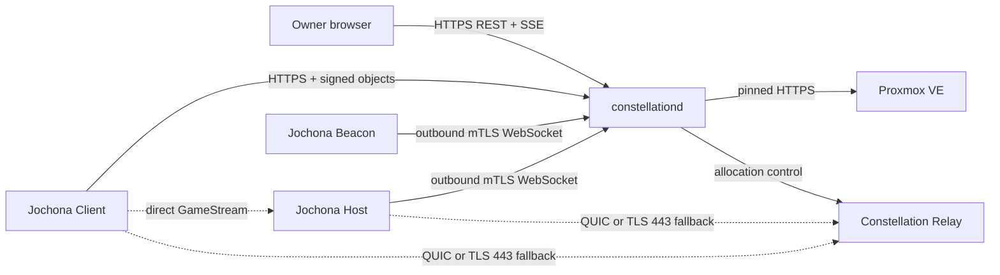

# Jochona Constellation Architecture

Status: accepted design

Jochona Constellation is an owner-hosted control plane for game-streaming fleets. It coordinates authority and lifecycle without becoming a required stream hop.

## Product boundary

Constellation owns these concerns:

- Organization identity, Device enrollment, Root Owner governance, Roles, Permissions, and Grants.
- Fleet, Machine, Host, Host Application, and Connector records.
- Explicit Reservations, Leases, Holds, Operations, Observations, and Projections.
- Proxmox power operations for registered QEMU virtual machines.
- Outbound control channels from Jochona Host and Jochona Beacon.
- Optional Relay allocation, quotas, accounting, and path selection.
- Audit, notifications, backup, restore fencing, and operational health.

Constellation does not own these concerns:

- Virtual-machine creation, GPU allocation, storage, networking, images, or Provider billing.
- GameStream capture, encoding, input, application launch, or baseline host pairing.
- A mandatory Jochona account, a Jochona-operated control plane, or a public relay pool.
- Arbitrary Provider scripts, hard shutdown in an automatic path, or unattended trust-anchor changes.

## Invariants

1. One Constellation Deployment serves one Organization.
2. The Organization owner controls the Deployment, keys, Provider accounts, and Relay nodes.
3. A Constellation outage cannot break an already valid direct path.
4. The server cannot mint Owner signatures or silently expand delegated authority.
5. Direct Client-to-Host streaming is the preferred path.
6. A Relay forwards only one authenticated allocation and cannot grant access.
7. Provider acceptance is not operation success. Success requires fresh evidence of the requested target state.
8. Desired Action, Infrastructure State, Host Readiness, Session Occupancy, and Route State remain separate facts.
9. Secrets never leave storage as plaintext after initial entry.
10. The automatic shutdown path uses a graceful Provider action only.

## Deployment topology



The owner can place `constellationd` behind an HTTPS reverse proxy. The Deployment has one canonical browser origin and an explicit trusted-proxy list.

Jochona Host and Jochona Beacon initiate their channels. Therefore, Constellation does not need inbound access to the managed LAN.

Constellation Relay is a separate deployment role. It can run on a public node without the Organization database or root signing keys.

## Deep modules and seams

The implementation uses a small set of deep modules. Tests and callers use the same interfaces.

| Module | Interface | Hidden behavior |
|---|---|---|
| Authority | Verify an identity or signed object; authorize an action over a scope | Passkeys, Device keys, quorum, revocation, Role union, field redaction, and no-amplification rules |
| Control Plane | Submit a command, ingest an Observation, read a Projection | Reservations, Leases, Holds, fencing, retries, cleanup, and state reconciliation |
| Provider Port | Start, request graceful shutdown, read power state, read task outcome | Provider-specific paths, authentication, polling, and error normalization |
| Host Channel | Deliver policy and requests; ingest sequenced Host snapshots | mTLS identity, resume cursors, capacity reservation, catalog order, and stale-session rejection |
| Beacon Channel | Deliver Wake Tickets; ingest presence and wake receipts | Enrollment, route scope, independent presence, and outage-safe direct wake |
| Relay Allocator | Preflight, hold capacity, allocate, renew, and release | Ticket attenuation, quota layers, node selection, accounting, and restart loss |
| Projection Store | Read current views and append durable facts | SQLite transactions, migrations, snapshots, retention, and recovery epochs |
| Audit Log | Append and export security or lifecycle events | Hash chaining, redaction, retention, severity, and export pagination |

The Provider Port is a true external seam. Production uses a Proxmox adapter, and tests use a deterministic in-memory adapter.

The Host, Beacon, and Relay channels are remote-owned seams. Their protocol adapters remain outside the Control Plane module.

Time, random generation, and storage transactions are internal seams. They do not appear in the public HTTP interface.

## Authority model

### Principals and permissions

A Principal is a Member, Service Principal, or Device. Role bindings attach scoped allow Permissions to Principals.

Effective permission is the union of applicable allows. Constellation has no deny language or implicit administrator bypass.

The Protected Root Owner authority is not a custom Role. Delegated administrators cannot create, assign, or exceed it.

Sensitive fields use separate read Permissions. A broad operational Role does not automatically expose identity, audit, or Connector secrets.

### Owner signatures

Each Owner Device creates a separate hardware-backed P-256 key when the platform supports one. Software keys require an explicit Organization posture policy.

The native Jochona Client signs canonical CBOR objects in COSE envelopes. A fresh platform verification is required for each authority signature.

Constellation prepares and distributes proposals. It cannot add the final Owner signature itself.

Root changes require an expiring quorum proposal. The proposal binds its exact contents, Organization, Deployment Epoch, nonce, and expiry.

### Invitations and Grants

Invitations are signed and single use. They enroll a Member or Device without a global Jochona account.

A Grant is independent of Role membership. It identifies stable Host Application IDs and carries explicit limits for time, concurrency, and bandwidth.

A Grant can require per-launch approval. Offline Host enforcement has a bounded validity window, with a 24-hour default.

Revocation affects future authorization immediately when online. Offline validity never extends beyond the signed bound.

## Lifecycle model

### State axes

| Axis | Examples | Authority |
|---|---|---|
| Desired Action | none, start requested, stop requested | accepted control command |
| Infrastructure State | stopped, starting, running, stopping, failed, unknown | Provider Observation |
| Host Readiness | unreachable, connecting, ready, degraded, stale | Host channel and freshness rules |
| Session Occupancy | free, reserved, active, disconnecting, unknown | Host and Client session evidence |
| Route State | direct available, Beacon available, Relay available, unknown | Client, Beacon, and Relay evidence |

A Projection combines these axes into one evidence-based sentence. It never replaces the source facts with a synthetic linear state.

### Play sequence

1. The Authority module verifies the Principal, Permission, Grant, and Host Application scope.
2. The Control Plane obtains an atomic Host Reservation.
3. The Control Plane creates a short intent Lease for the Principal.
4. The Provider adapter starts the Machine when Infrastructure State requires it.
5. The Control Plane records the native Provider task and waits for its outcome.
6. A fresh Provider Observation must show the Machine running.
7. A fresh Host snapshot must show readiness and the reserved capacity.
8. The Client receives route and launch material for the authorized Host Application.
9. The Host attests the active Session before the intent Lease becomes an active Lease.
10. The Client streams directly unless direct-path checks select an authorized Relay allocation.

A busy Host returns explicit choices. Constellation does not queue an unbounded request or terminate another Principal's Session.

### End and shutdown sequence

1. Host and Client evidence marks the Session ended.
2. The active Lease ends after reconciliation.
3. Other active Leases and Holds keep the Machine running.
4. When none remain, the configured idle grace starts. The default is ten minutes.
5. Fresh Host evidence must show no active Session before shutdown proceeds.
6. The Proxmox adapter requests a graceful shutdown.
7. Success requires both a successful Provider task and a fresh stopped Observation.

A lost heartbeat cannot prove Session absence. Network loss therefore delays destructive work until policy and freshness requirements are met.

### Cancellation and recovery

Cancellation ends the requesting Principal's intent. It does not terminate an unrelated Session or bypass another Lease.

A failed boot triggers bounded cleanup only when fresh evidence proves isolation. Otherwise, the Projection reports the unresolved condition.

After restart, the Control Plane observes Provider and Host state before it retries an unfinished Operation. Each Machine has a fencing sequence.

External Provider changes become Observations and audit events. Constellation explains drift instead of rewriting history.

## Provider model

The first Provider adapter supports owner-managed Proxmox VE and existing QEMU virtual machines only.

Connector setup requires these facts:

- An explicit Proxmox endpoint and pinned CA or SPKI identity.
- A privilege-separated API token with an allowlisted permission set.
- An explicit node and VMID for each Machine.
- A separate binding to the enrolled Jochona Host identity.
- A read-only connection test before the Connector becomes healthy.

The adapter can read state, start a VM, request graceful shutdown, and read native task outcomes. It cannot create, delete, reconfigure, or migrate a VM.

The Connector can reach only its pinned endpoint. Constellation never returns its secret after storage.

## Protocols

| Use | Transport and format |
|---|---|
| Browser administration | Versioned HTTPS REST with JSON requests and responses |
| Browser and Client events | Resumable Server-Sent Events with event IDs and snapshot recovery |
| Host, Beacon, and Relay control | Mutual-TLS WebSocket with versioned CBOR envelopes |
| Owner authority objects | Deterministic CBOR in COSE signatures |
| Relay data plane | Authenticated multiplexed QUIC; degraded TLS on port 443 when QUIC fails |

The repository owns machine-readable OpenAPI, JSON Schema, CDDL, and golden vectors. Generated artifacts never become the source of truth.

Readers ignore unknown optional fields. They reject unknown required features before they mutate state.

Each channel negotiates a protocol version and feature set. A missing capability never becomes an assumed capability.

## Relay security and privacy

A Relay allocation binds the Organization, Grant, Client Device, Host, Host Application, Relay node, quotas, and expiry.

The Relay forwards no packet before both endpoints prove a valid allocation ticket. QUIC address validation limits unauthenticated state and amplification.

Jochona Client and Jochona Host negotiate native full GameStream encryption. The Host rejects Relay launch when that encryption is absent.

Relay operators can observe endpoint addresses, timing, allocation identifiers, and byte counts. Product copy and the UI disclose this metadata exposure.

Allocations are ephemeral. A Relay restart requires a new allocation and produces a visible reconnect state.

Authenticated endpoints can migrate addresses within the same allocation. Tickets never authorize general proxy traffic.

## Persistence and recovery

A single-node Deployment uses SQLite in WAL mode. The database stores identity metadata, policy, Machines, Operations, Observations, Projections, and audit records.

An external master key encrypts stored secrets with per-record data keys. Database backups alone cannot expose Connector or private-key material.

Backups are encrypted and preserve Organization identity. Restore creates a new, Root Owner-approved Deployment Epoch before control resumes.

Epoch fencing prevents the original and restored Deployments from controlling the same Organization concurrently.

A scrubbed clone removes secrets and authority while retaining redacted operational structure for tests. Portable exports are versioned and redacted.

## Operations

Static configuration contains listen addresses, canonical origin, trusted proxies, database path, master-key source, TLS mode, and log destination.

The database contains Organization policy, identities, Fleets, Connectors, Machines, Hosts, Grants, Relay nodes, and notification settings.

The process runs rootless by default as a Linux binary or OCI image. It exposes separate liveness and authenticated readiness endpoints.

Shutdown stops new control work, drains active mutations, persists checkpoints, and closes channels. It does not wait for streaming Sessions to end.

Schema migration uses an explicit preflight and one-way apply step. The process refuses a database schema newer than its supported version.

Notifications include an in-product inbox and optional signed webhooks. A notification never authorizes or completes an Operation.

## Repository shape

```text
constellation/
├── Cargo.toml
├── crates/
│   ├── constellation-core/       # authority, policy, lifecycle, projections
│   ├── constellation-protocol/   # wire objects, signatures, schema vectors
│   ├── constellation-store/      # SQLite, migrations, audit, backup
│   ├── constellation-proxmox/    # Provider adapter
│   ├── constellationd/           # administration and control-channel binary
│   └── jochona-relay/            # allocation and data-plane binary
├── web/                           # TypeScript administration UI
├── protocol/
│   ├── openapi/
│   ├── schema/
│   ├── cddl/
│   └── vectors/
├── migrations/
└── tests/
    ├── contract/
    ├── integration/
    └── hardware/
```

`constellation-core` owns the deep Control Plane interface. Transport handlers translate requests and never duplicate policy or lifecycle rules.

## Verification contract

- Rust, TypeScript, Client, Host, Beacon, and Relay consumers run the same golden vectors.
- Contract tests cover signed objects, envelopes, HTTP shapes, tickets, errors, and unknown-field behavior.
- Property tests cover Permission union, scope containment, Lease transitions, fencing, and time bounds.
- Fuzzers cover every untrusted parser and state-transition entry point.
- Integration tests use a real SQLite database and deterministic Provider, Host, Beacon, and Relay adapters.
- A protected hardware lane uses a real Proxmox node, a Windows QEMU guest, Jochona Host, and Jochona Client.
- Release artifacts include signatures, provenance, dependency locks, an SBOM, and migration checks.
- Friends and Relay cannot become stable before a published threat model and independent security review.
